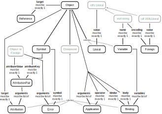
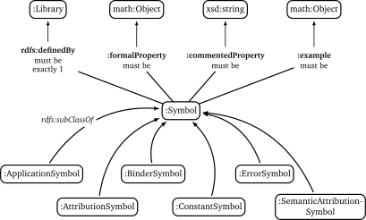

:imagesdir: ./images

= OpenMath-RDF: RDF encodings for OpenMath objects and Content Dictionaries

This document specifies RDF encodings for OpenMath objects and Content
Dictionaries that allow mathematical objects and symbol definitions to
be first-class citizens on the Web of Data.

== Ontology for OpenMath objects

The RDF data model for OpenMath objects is specified as  <>.

[#img-openmath-ontology]
.Ontology of OpenMath objects

The ontology was developed by starting with the OpenMath XML
serialization and mapping of its elements like `OMV` or `OMA` to classes
with speaking names like `Variable` or `Application` and by modelling
their attributes as RDF properties.

=== Basic OpenMath objects

Integers, floating point numbers, character strings and byte arrays are
directly represented using typed RDF literals. They are modelled by the
class `:Literal` with the property `:value` for the associated values.

The ontology does not yet restrict the range of `:value`, and hence,
besides the core OpenMath literal types `xsd:integer` (Integer),
`xsd:double` (IEEE floating point number), `xsd:string` (Character
string) and `xsd:base64Binary` (Byte array), allows other datatypes like
`xsd:int` (32-bit integers) or `xsd:time`.

For ensuring the compatibility with OpenMath 2 only the RDF types of
core OpenMath literals should be used. To enforce this it is also
possible to either restrict the range of `:value` by a union class (in
Manchester OWL Syntax) like

[source]
....
xsd:integer or xsd:double or xsd:string or xsd:base64Binary
....

or by defining subclasses of `:Literal` like `:IntegerLiteral` and
others.

The OpenMath-RDF encoding also omits the hexadecimal encodings for
numbers in favour of using standard RDF literal types. If support for
hexadecimal literals is required then custom RDF datatypes can be used.

Variables are represented as instances of class `:Variable` with a
property `:name`. The variable _x_ can, for example, be
represented as:

[source,turtle]
....
_:x a :Variable ; :name "x" .
....

It is allowed to freely choose the identification of RDF nodes in
OpenMath-RDF as it has no influence of the semantics. Consequently,
instead of using an anonymous RDF node `_:x` for the variable in the
previous example, it could have been also named with a URI like
`<var:x>` or `http://example.org/x` to allow global references.

According to the OpenMath standard the scheme `<cdbase/cd#name>`  can be
used to create canonical URIs for symbols. Accordingly the symbol `sin`
from the content dictionary `transc1` can be encoded as
`<http://www.openmath.org/cd/transc1#sin>`. OpenMath-RDF uses this kind
of URIs to encode symbols and not the individual attributes `cdbase`,
`cd` and `name` as used by the XML encoding.

=== Compound objects

A fundamental difference between XML and RDF lies in the fact, that XML
uses a native tree structure while RDF is graph-based. For compound
objects OpenMath-XML can rely on the tree structure to represent syntax
trees of OpenMath expressions.

For the representation of application objects (OMA) in RDF the additional property `:arguments` is required. It
references a list of arguments while the property `:operator` determines
the function that is applied to to the arguments. A similar
representation is also used for the other compound objects _binding_
(OMBIND), _attribution_ (OMATTR) and _error_ (OME). This is in line with
the OpenMath JSON encoding that also uses additional properties to
represent parent-child relationships.

The resulting RDF representation of the expression `sin(x + y)` is shown in following example.

[#lst-openmath-rdf-example]
.Example: RDF encoding of `sin(x + y)`
[source,turtle]
....
@prefix : <http://numerateweb.org/vocab/math#> .

[] a :Application ;
  :operator <http://www.openmath.org/cd/transc1#sin> ;
  :arguments (
    [ a :Application ;
      :operator <http://www.openmath.org/cd/arith1#plus> ;
      :arguments (
        [ a :Variable ; :name "x" ] [ a :Variable ; :name "y" ]
      )
    ]
  ) .
....

Caused by the additional
properties the syntax is less compact as with the XML format but offers
stronger semantics. For example, the meaning of the child elements is
directly expressed through the properties `:operator` and `:arguments`.

=== References

References are used within the XML and binary encodings to share
OpenMath objects between multiple expressions. These references are
basically not required in RDF since the linking of objects is directly
supported through URIs or anonymous identifieres (blank nodes).

Nonetheless, OpenMath-RDF defines the class `:Reference` with the
property `:target`. This opens up the possibilty to give OpenMath
objects multiple names and to use the references as some kind of
symbolic links as known by typical file systems.

The function _f(x) = x^2_ is mainly represented as RDF node
with the URI `<http://example.org/square-func>`
(<<lst:openmath-rdf-references>>).
By using a named reference the function is also available via the URI
`<http://example.org/power-2>`.

[#lst:openmath-rdf-references]
.Example: Reference to a function
[source,turtle]
....
@base <http://example.org/> .
@prefix : <http://numerateweb.org/vocab/math#> .

<square-func> a :Binding ;
  :binder <http://www.openmath.org/cd/fns1#lambda> ;
  :variables (_:x) .
  :body [
    a :Application ;
    :operator <http://www.openmath.org/cd/arith1#power> ;
    :arguments (_:x 2)
  ] .
_:x a :Variable ; :name "x" .
<power-2> a :Reference ; :target <square-func> .
....

=== Derived objects

To embed non-OpenMath objects into OpenMath objects of type
_attribution_ or _error_ _derived OpenMath objects_ can be represented
by instances of class `:Foreign`. Its property `:value` has the range
`rdf:XMLLiteral` and the property `:encoding` uses an `xsd:string` to
specify the content type. This allows to accept simple character strings
as well as complete XML documents with nested OpenMath objects.

== Transformation between OpenMath-XML and OpenMath-RDF

For the transformation from XML to RDF an operator _T_ can
be defined. It converts the XML encoding of an OpenMath object
_O~XML~_ to an RDF graph _T(O~XML~)_ containing the equivalent RDF
encoding. The rules of the transformation operator _T_ are
summarized in Table #tab:omxml-omrdf[[tab:omxml-omrdf]].

The mapping is recursively defined by using the operator _T_
for the top-level element and all of its sub elements. The generated
triples by each invocation of _T_ are inserted in the
resulting RDF graph. The _main node_ in each transformation rule, which
is always the subject of the first triple, is the result value of the
operator invocation and is used for subsequent transformations.

To accomodate for the differences in the encoding of numbers and URIs
between OpenMath-XML and OpenMath-RDF the following helper functions are
used to define the operator _T_:

DEC(HEX)::
converts a floating point number `HEX` in hexadecimal encoding into an
equivalent decimal representation. This function is necessary because
OpenMath-RDF only supports XML-Schema-Datatypes and hence no
hexadecimal encodings for floating point numbers.
BASE10(INT)::
converts an integer `INT` in decimal or hexadecimal representation to
a decimal integer.
RESOLVE(URI)::
creates an absolute URI according to the rules defined in section 5.
"Reference Resolution" of the URI specification [S. 27 ff.]. This
function is necessary because RDF only supports _absolute URIs_ as
identifiers.
+
If, for example, the operator _T_ directly creates a
Turtle document then the resolution of URIs is not necessary since the
Turtle parser resolves URIs automatically against a base URI according
to sections 6.3 "IRI References" and 7. "Parsing" of the Turtle
specification. This base URI has to be specified in accordance to the
source OpenMath-XML document.
+
Therefore an OpenMath-XML document at the address
`http://example.org/` with the content
+
[source,xml]
----
<OMOBJ><OMR href="named" /></OMOBJ>
----
+
can be translated into an equivalent Turtle document with the content
+
[source,turtle]
....
@base <http://example.org/> .
@prefix : <http://numerateweb.org/vocab/math#> .

[] a :Reference ; :target <named> .
....
+
The relative URI `<named>` can be kept in the document and by
specifying the base URI `@base <http://example.org/>` correctly
resolved to an absolute URI by a Turtle parser.
+
With a few exceptions (numbers, URIs, referenes) the operator
_T_ defines an unambiguous mapping between XML and RDF.
Therefore an inverse operator _T^&nbsp;-1^_ for converting RDF
to XML can be easily defined. For handling the exceptions, floating
point numbers and integers can either be translated into a decimal or
a hexadecimal encoding as OpenMath-XML supports both formats.
References to other OpenMath objects can either be directly resolved
and copies of the referenced objects in OpenMath-XML format included
or `<OMR>` elements can be created with respective relative or
absolute URIs.

[cols="1,2"]
|===
|*OpenMath-XML* -- _O~XML~_ | *OpenMath-RDF* -- _T(O~XML~)_

2+| *Basic objects*
a|
[source,xml]
<OMF dec="DEC" />
a|
[source]
_:l a :Literal ; :value "DEC"^^xsd:double .

a|
[source,xml]
<OMF hex="HEX" />
a|
[source]
_:l a :Literal ;
    :value "DEC(HEX)"^^xsd:double .

a|
[source,xml]
<OMI>INT</OMI>
a|
[source]
_:l a :Literal ;
   :value "BASE10(INT)"^^xsd:integer .

a|
[source,xml]
<OMSTR>STRING</OMSTR>
a|
[source]
_:l a :Literal ; :value "STRING" .

a|
[source,xml]
<OMB>BYTES</OMB>
a|
[source]
_:l a :Literal ;
  :value "BYTES"^^xsd:base64Binary

a|
[source,xml]
<OMV name="NAME" />
a|
[source]
_:o a :Variable ; :name "NAME" .

a|
[source,xml]
<OMS cd="CD" name="NAME" />
a|
[source]
<CDBASE/CD#NAME> a :Symbol .

2+| *Compound objects*
a|
[source,xml]
<OMA>OP A1 ... An</OMA>`
a|
[source]
_:c a :Application ; :operator T(OP) ; `
    :arguments (T(A1) ... T(An)) .

a|
[source,xml]
<OMBIND>
    B
    <OMBVAR>V1 ... Vn</OMBVAR>
    C
</OMBIND>
a|
[source]
_:c a :Binding ; :binder T(B) ; :body T(C) ;`
    :variables (T(V1) ... T(Vn)) .

a|
[source,xml]
<OMATTR>
  <OMATP>
      S1 A1 ... Sn An
  </OMATP>
  X
</OMATTR>
a|
[source]
_:c a :Attribution ; :target T(X) ; :arguments (
    [ :attributeKey T(S1) ; :attributeValue T(A1) ]
    ...
    [ :attributeKey T(Sn) ; :attributeValue T(An) ] ) .

a|
[source,xml]
<OME>S A1 ... An</OME>
a|
[source]
_:c a :Error ; :symbol T(S) ;
    :arguments (T(A1) ... T(An)) .

2+| *Named objects & references*
a|
[source,xml]
<... id="URI" />
a|
[source]
<RESOLVE(URI)> a ... .

a|
[source,xml]
<OMR href="URI" />
a|
[source]
_:o a :Reference ; :target <RESOLVE(URI)> .

2+| *Derived objects*
a|
[source,xml]
<OMFOREIGN encoding="ENC">
    BODY
</OMFOREIGN>
a|
[source]
_:o a :Foreign ; :encoding "ENC" ;
    :value "BODY"^^rdf:XMLLiteral .
|===

== Query OpenMath with SPARQL

OpenMath-RDF allows to use SPARQL as query language to traverse, filter
and transform mathematical objects. With SPARQL 1.1 it is also possible
to use path expressions for recursive traversals.

As an example the SPARQL query

[source,sparql]
....
SELECT ?result WHERE {
  ?result (math:arguments|math:symbol|...|rdf:rest)+ ?o .
  {
    ?o <>? <http://www.openmath.org/cd/arith1#sum> .
  } UNION {
    ?o <>? <http://www.openmath.org/cd/arith1#product> .
  } FILTER NOT EXISTS {
    [] math:arguments|math:symbol|...|rdf:rest ?result .
  }
}
....

finds all root expressions that either contain a `sum` or a `product`
symbol.

The property path `math:arguments|math:symbol|...|rdf:first` is a
shortened version of the path
[source]
....
math:arguments|math:symbol|math:operator|math:target|math:variables|
  math:binder|math:body|math:attributeKey|math:attributeValue|
  rdf:rest|rdf:first
....

which ensures that only properties of mathematical objects are traversed
by the expression. It would also be possible to just use something like
`<>|!<>` if it is acceptable to traverse any edge within the RDF graph.

The property path `<>?` is a trick and expected to always be empty. It
is used to avoid the repetition of the long property path
`math:arguments|math:symbol|...|rdf:first` for traversing the expression
and also may lead to faster execution times if the SPARQL engine is not
able to properly optimize the queries.

== Representation of Content Dictionaries in RDF

OpenMath Content Dictionaries are usually encoded as XML documents. In
combination with the RDF encoding introduced in the previous sections
Content Dictionaries may also be represented as linked data.

[#img-openmath-ontology]
.Ontology of OpenMath Content Dictionaries

The core of the vocabulary are classes for different types of
mathematical symbols as defined by the OpenMath standard which are
represented by subclasses of `Symbol`. Each symbol is defined
(`rdfs:definedBy`) by a Content Dictionary that the ontology models as
`Library`. Formal properties (`formalProperty`) of the symbols and usage
examples (`example`) refer to mathematical objects as defined by the
OpenMath-RDF ontology.

To verify the RDF encoding based on OpenMath-RDF and the meta data
ontology 214 Content Dictionaries with 1578 symbols published on the
OpenMath web site were converted to an RDF representationfootnote:[The
RDF version of the Content Dictionaries is available at
https://github.com/numerateweb/openmath-cd (29.06.2021)].

== Related work

In 2003 Marchiori <<marchiori2003>> outlined the idea and possible applications of
representing mathematical expressions as part of the Semantic Web.
Advantages are seen in an RDF representation that enables the reuse of
Semantic Web languages and tools to support functions like search,
annotation or inference on mathematical knowledge. Basic ideas for a
direct conversion of MathML to RDF without an explicit ontology are also
given in the paper. Marchiori also names the possible computability as a
``cool functionality'' of mathematical formulas on the Semantic Web.

In 2011 Lange <<lange2011>> worked on methods for the collaborative 
creation and exchange of semiformal mathematical content. The authors introduce the
OMDoc ontology (Open Mathematical Documents) for the exchange of
mathematical statements and theories on the internet. The ontology is
defined in OMDoc itself since the authors state that the expressiveness
of OWL is insuffient for the representation of all aspects of OMDoc.
Additional to OMDoc an OWL based ontology for the description of
OpenMath Content Dictionaries is introduced. It is able to represent
metadata about symbols and their usage within mathematical expressions
but not the expressions themselves. Both ontologies are used to
implement a wiki system called SWiM (Semantic Wiki for Mathematical
Knowledge Management) for the collaborative work on mathematical
documents.

In 2012 Ferré <<ferre2012>> proposed a lightweight RDF vocabulary for the
representation of mathematical expressions mainly for the use case of
content-based search. The vocabulary is solely based on existing RDF and
RDFS properties and hence there is no explicit ontology. The property
`rdf:type` is used as constructor of mathematical operations where each
object is an instance of `rdfs:Container` and the properties rdf:_1,
rdf:_2, …, rdf:_n are used to represent its arguments.

For example, the expression _(a + 2 ) * 3_ would be
represented as

[source,turtle]
....
[ a math:Times ;
  rdf:_1 [ a math:Plus ; rdf:_1 _:a ; rdf:_2 2 ] ; rdf:_2 3 ] .
_:a rdfs:label "a" .
....

in Turtle format.

The syntax is comparable to the notation used by the programming
language Lisp that may represent the expression as

[source]
....
(math:Times (math:Plus a 2) 3)
....

Due to the missing ontology, semantics of the RDF representation is
limited, for example, constants and variables are only implicitly
distinguishable based on their node kind (constants are RDF literals and
variables are blank nodes with a label). Since the representation was
developed for structural search, a language construct for binding the
variables of a lambda function as required for computations is not
supported.

In 2014 Muñoz et al. <<munoz2014>>  developed an ontology for mathematical
expressions that also supports references from mathematical models to
elements of a domain model. However, the approach uses a highly
proprietary vocabulary and is not based on any standards like MathML
or OpenMath.

[bibliography]
== References

* [[[marchiori2003]]] MARCHIORI, Massimo: The Mathematical Semantic Web. Version: 2003. 
In: ASPERTI, Andrea (ed.) ; BUCHBERGER, Bruno (ed.) ; DAVENPORT, James H. (ed.): Mathematical Knowledge Management Bd. 2594. Berlin, Heidelberg

* [[[lange2011]]]LANGE, Christoph: Enabling Collaboration on Semiformal Mathematical Knowledge by Semantic Web Integration, Jacobs University Bremen, Diss., 2011

* [[[ferre2012]]]FERRÉ, Sébastien: An RDF Vocabulary for the Representation and Exploration of Expressions with an Illustration on Mathematical Search. https://hal.inria.fr/hal-00812197. Version: 2012

* [[[munoz2014]]] MUÑOZ, Edrisi ; CAPÓN-GARCÍA, Elisabet ; LAÍNEZ-AGUIRRE, José M. ; ESPUÑA, Antonio ; PUIGJANER, Luis: Using mathematical knowledge management to support integrated decision-making in the enterprise. 
In: Computers & Chemical Engineering 66 (2014), Juli, 139-150. 
http://dx.doi.org/10.1016/j.compchemeng.2014.